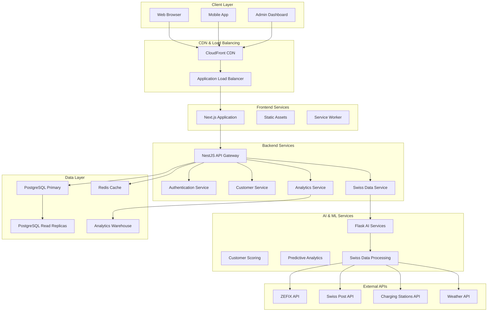
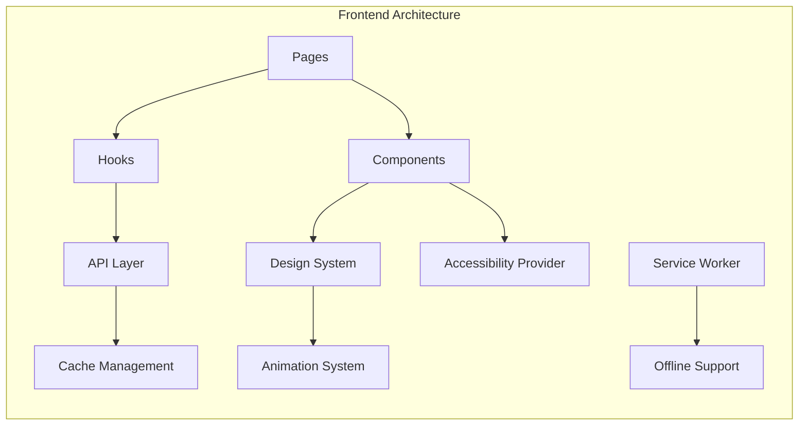
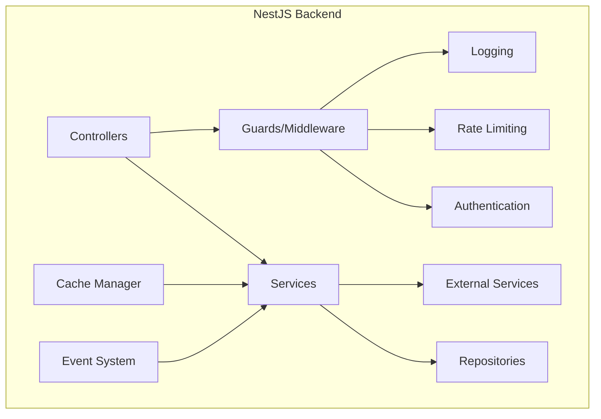
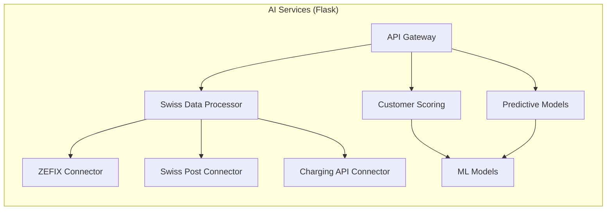
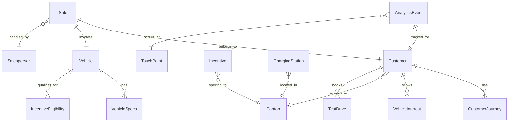
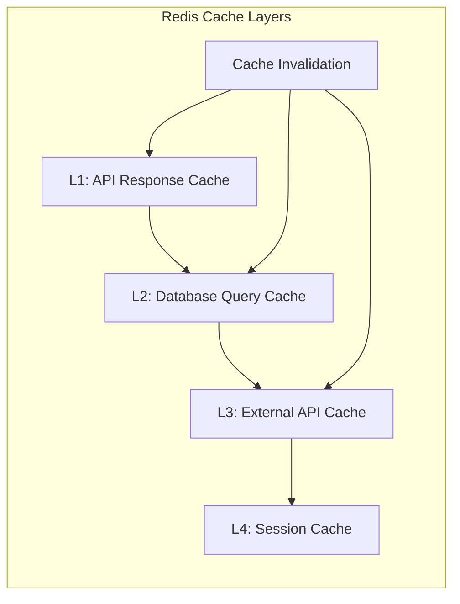
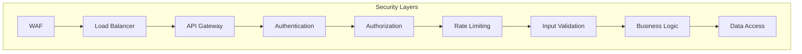
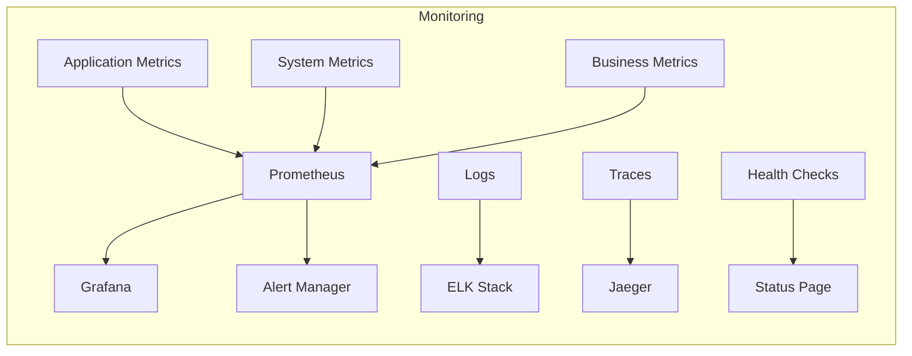
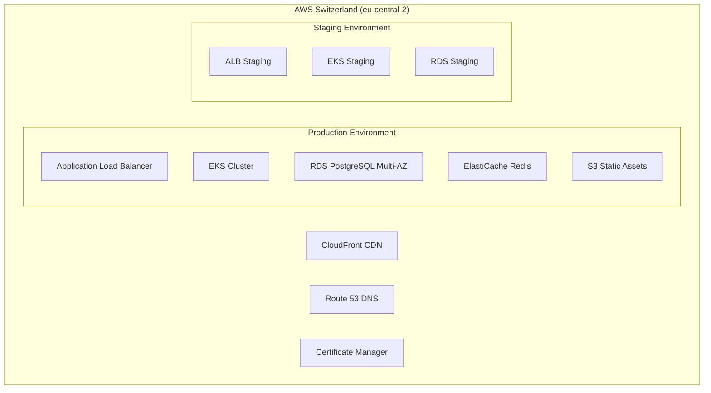
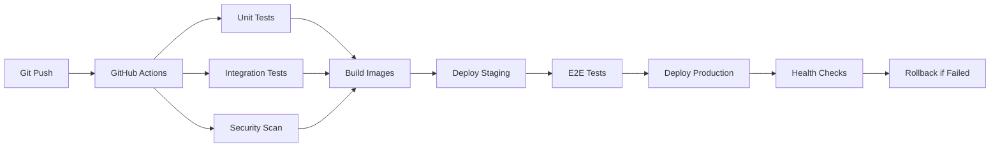

# System Architecture Documentation

## 📋 Overview

The Cadillac EV Customer Intelligence System is built on a modern, scalable microservices architecture optimized for the Swiss electric vehicle market. The system emphasizes performance, accessibility, and seamless integration with Swiss governmental and commercial APIs.

---

## 🏗️ High-Level Architecture



---

## 🎯 Architecture Principles

### 🚀 Performance First
- **Sub-200ms API responses** with intelligent caching
- **Progressive loading** with skeleton screens
- **Code splitting** for optimal bundle sizes
- **CDN integration** for global content delivery

### ♿ Accessibility by Design
- **WCAG 2.1 AA compliance** throughout the system
- **Screen reader optimization** with semantic HTML
- **Keyboard navigation** support for all interactions
- **High contrast and reduced motion** support

### 🇨🇭 Swiss Market Focus
- **Local data residency** within Switzerland
- **DSG compliance** for data protection
- **Multi-language support** (DE, FR, IT, RM)
- **Canton-specific business logic** for regulations

### 📈 Scalability & Reliability
- **Horizontal scaling** with Kubernetes
- **Circuit breaker patterns** for external API calls
- **Graceful degradation** when services are unavailable
- **No mock data policy** for data integrity

---

## 🏢 Service Architecture

### 🎨 Frontend Layer (Next.js)



**Key Features:**
- **Server-Side Rendering (SSR)** for SEO and performance
- **Component-based architecture** with reusable design system
- **Progressive Web App (PWA)** capabilities
- **Advanced caching** with SWR and service workers
- **Real-time updates** via WebSocket connections

**Performance Optimizations:**
```typescript
// Code splitting example
const LazyAnalytics = lazy(() => import('@/components/analytics/AnalyticsDashboard'));

// Image optimization
import Image from 'next/image';
<Image src="/hero.jpg" alt="Cadillac EV" width={800} height={600} priority />

// API data fetching with caching
const { data, error } = useSWR('/api/customers', fetcher, {
  revalidateOnFocus: false,
  dedupingInterval: 60000,
});
```

### 🔧 Backend Layer (NestJS)



**Core Services:**

#### 1. Customer Service
```typescript
/**
 * Customer management with Swiss market specifics
 * - ZEFIX company validation
 * - Canton-based segmentation
 * - Multi-language support
 */
@Injectable()
export class CustomerService {
  async createCustomer(data: CreateCustomerDto): Promise<Customer> {
    // Validate Swiss postal code
    await this.swissDataService.validatePostalCode(data.postalCode);
    
    // ZEFIX company lookup for business customers
    if (data.type === 'business') {
      await this.swissDataService.lookupCompany(data.companyName);
    }
    
    return this.customerRepository.create(data);
  }
}
```

#### 2. Swiss Data Service
```typescript
/**
 * Integration with Swiss APIs maintaining no-mock-data principle
 * - ZEFIX (Federal Commercial Registry)
 * - Swiss Post (Postal codes)
 * - ich-tanke-strom.ch (Charging stations)
 */
@Injectable()
export class SwissDataService {
  async lookupCompany(query: string): Promise<ZEFIXCompanyData> {
    try {
      return await this.zefixAPI.search(query);
    } catch (error) {
      // No mock data - return service unavailable
      throw new ServiceUnavailableException('ZEFIX service unavailable');
    }
  }
}
```

#### 3. Analytics Service
```typescript
/**
 * Business intelligence and predictive analytics
 * - Customer journey tracking
 * - Sales funnel analysis
 * - ROI calculations
 */
@Injectable()
export class AnalyticsService {
  async getCustomerJourney(customerId: string): Promise<CustomerJourney> {
    const journey = await this.journeyRepository.findByCustomerId(customerId);
    const predictions = await this.aiService.predictNextSteps(journey);
    
    return {
      ...journey,
      predictions,
      recommendations: this.generateRecommendations(journey)
    };
  }
}
```

### 🤖 AI Services Layer (Flask)



**Key Components:**

#### 1. Swiss Data Processing
```python
"""
Swiss-specific data processing and normalization
Handles integration with Swiss governmental and commercial APIs
"""
@app.route('/swiss-data/company-lookup', methods=['POST'])
def company_lookup():
    try:
        # Real ZEFIX API integration
        response = zefix_client.search(request.json['query'])
        return jsonify({
            'success': True,
            'data': normalize_zefix_data(response),
            'source': 'ZEFIX'
        })
    except APIUnavailableError:
        # No mock data - clear service unavailable message
        return jsonify({
            'success': False,
            'error': 'ZEFIX service is currently unavailable',
            'service_unavailable': True
        }), 503
```

#### 2. Customer Intelligence
```python
"""
ML-powered customer insights and predictions
"""
class CustomerScoringModel:
    def predict_conversion_probability(self, customer_data):
        # Features: demographics, journey stage, vehicle interest, etc.
        features = self.feature_engineer(customer_data)
        return self.model.predict_proba(features)[0][1]
    
    def predict_churn_risk(self, customer_id):
        # Analyze customer behavior patterns
        behavior = self.get_customer_behavior(customer_id)
        return self.churn_model.predict(behavior)
```

---

## 💾 Data Architecture

### 🗄️ Database Design



#### Primary Database (PostgreSQL)
```sql
-- Customer table with Swiss-specific fields
CREATE TABLE customers (
    id UUID PRIMARY KEY DEFAULT gen_random_uuid(),
    name VARCHAR(255) NOT NULL,
    email VARCHAR(255) UNIQUE NOT NULL,
    phone VARCHAR(20),
    
    -- Swiss address fields
    street VARCHAR(255),
    city VARCHAR(100),
    postal_code CHAR(4), -- Swiss postal codes are 4 digits
    canton CHAR(2) REFERENCES cantons(code),
    
    -- Business customer fields
    company_name VARCHAR(255),
    zefix_uid VARCHAR(20), -- Swiss UID format
    
    -- Preferences
    preferred_language CHAR(2) DEFAULT 'de',
    vehicle_interests JSONB,
    budget_range_min INTEGER,
    budget_range_max INTEGER,
    
    -- Timestamps
    created_at TIMESTAMP DEFAULT NOW(),
    updated_at TIMESTAMP DEFAULT NOW()
);

-- Swiss cantons reference table
CREATE TABLE cantons (
    code CHAR(2) PRIMARY KEY,
    name_de VARCHAR(50) NOT NULL,
    name_fr VARCHAR(50),
    name_it VARCHAR(50),
    name_rm VARCHAR(50)
);

-- Customer journey tracking
CREATE TABLE customer_journey_events (
    id UUID PRIMARY KEY DEFAULT gen_random_uuid(),
    customer_id UUID REFERENCES customers(id),
    event_type VARCHAR(50) NOT NULL,
    event_data JSONB,
    touchpoint VARCHAR(100),
    timestamp TIMESTAMP DEFAULT NOW(),
    
    -- Performance indexes
    INDEX idx_customer_journey_customer_id (customer_id),
    INDEX idx_customer_journey_timestamp (timestamp),
    INDEX idx_customer_journey_event_type (event_type)
);
```

#### Caching Strategy (Redis)



**Cache Implementation:**
```typescript
// Multi-layer caching strategy
@Injectable()
export class CacheService {
  // L1: API Response caching (30 seconds)
  async cacheApiResponse(key: string, data: any, ttl = 30): Promise<void> {
    await this.redis.setex(`api:${key}`, ttl, JSON.stringify(data));
  }
  
  // L2: Database query caching (5 minutes)
  async cacheQuery(sql: string, params: any[], result: any): Promise<void> {
    const key = this.generateQueryKey(sql, params);
    await this.redis.setex(`query:${key}`, 300, JSON.stringify(result));
  }
  
  // L3: External API caching (15 minutes)
  async cacheExternalApi(endpoint: string, data: any): Promise<void> {
    await this.redis.setex(`external:${endpoint}`, 900, JSON.stringify(data));
  }
}
```

---

## 🔐 Security Architecture

### 🛡️ Multi-Layer Security



#### Authentication & Authorization
```typescript
// JWT-based authentication with Swiss privacy compliance
@Injectable()
export class AuthService {
  async authenticateUser(credentials: LoginDto): Promise<AuthResult> {
    const user = await this.validateCredentials(credentials);
    
    // Generate JWT with Swiss data residency claims
    const payload = {
      sub: user.id,
      email: user.email,
      roles: user.roles,
      canton: user.canton, // Swiss-specific claim
      dataResidency: 'CH' // Ensures Swiss data handling
    };
    
    return {
      accessToken: this.jwtService.sign(payload),
      refreshToken: await this.generateRefreshToken(user.id),
      user: this.sanitizeUser(user)
    };
  }
}
```

#### Data Protection (DSG Compliance)
```typescript
// Swiss Data Protection Act compliance
@Injectable()
export class DataProtectionService {
  // Encrypt PII data at rest
  encryptPersonalData(data: any): string {
    return this.encryption.encrypt(JSON.stringify(data), {
      algorithm: 'aes-256-gcm',
      keyDerivation: 'pbkdf2',
      jurisdiction: 'CH' // Swiss jurisdiction
    });
  }
  
  // Data retention policies
  async scheduleDataDeletion(customerId: string, retentionPeriod: number): Promise<void> {
    const deleteAt = new Date(Date.now() + retentionPeriod);
    await this.scheduler.schedule('deleteCustomerData', deleteAt, { customerId });
  }
}
```

---

## 📊 Monitoring & Observability

### 📈 Monitoring Stack



#### Key Metrics

**Performance Metrics:**
```typescript
// Custom metrics for Swiss market specifics
const swissApiResponseTime = new prometheus.Histogram({
  name: 'swiss_api_response_time_seconds',
  help: 'Response time for Swiss API integrations',
  labelNames: ['api_type', 'canton', 'status']
});

const customerJourneyProgression = new prometheus.Counter({
  name: 'customer_journey_stage_transitions_total',
  help: 'Customer journey stage transitions',
  labelNames: ['from_stage', 'to_stage', 'canton']
});
```

**Business Intelligence:**
```sql
-- Real-time business metrics
SELECT 
  canton,
  COUNT(*) as total_customers,
  COUNT(*) FILTER (WHERE created_at > NOW() - INTERVAL '24 hours') as new_customers_24h,
  AVG(CASE WHEN vehicle_purchased_at IS NOT NULL 
      THEN EXTRACT(EPOCH FROM vehicle_purchased_at - created_at) / 86400 
      END) as avg_conversion_days
FROM customers 
GROUP BY canton;
```

---

## 🚀 Deployment Architecture

### ☁️ Cloud Infrastructure



#### Kubernetes Deployment
```yaml
# Production deployment configuration
apiVersion: apps/v1
kind: Deployment
metadata:
  name: cadillac-ev-cis-backend
  namespace: production
spec:
  replicas: 5
  strategy:
    type: RollingUpdate
    rollingUpdate:
      maxSurge: 2
      maxUnavailable: 1
  selector:
    matchLabels:
      app: cadillac-ev-cis-backend
  template:
    metadata:
      labels:
        app: cadillac-ev-cis-backend
    spec:
      containers:
      - name: backend
        image: cadillac/ev-cis-backend:latest
        ports:
        - containerPort: 3001
        env:
        - name: NODE_ENV
          value: "production"
        - name: DATABASE_URL
          valueFrom:
            secretKeyRef:
              name: database-secrets
              key: url
        resources:
          requests:
            memory: "512Mi"
            cpu: "500m"
          limits:
            memory: "1Gi"
            cpu: "1000m"
        livenessProbe:
          httpGet:
            path: /api/health
            port: 3001
          initialDelaySeconds: 30
          periodSeconds: 10
        readinessProbe:
          httpGet:
            path: /api/ready
            port: 3001
          initialDelaySeconds: 5
          periodSeconds: 5
```

---

## 🔄 CI/CD Pipeline



**GitHub Actions Workflow:**
```yaml
name: Deploy to Production
on:
  push:
    branches: [main]

jobs:
  test:
    runs-on: ubuntu-latest
    steps:
      - uses: actions/checkout@v3
      - name: Run Tests
        run: |
          npm ci
          npm run test:unit
          npm run test:integration
          npm run test:a11y
          npm run test:security
  
  deploy:
    needs: test
    runs-on: ubuntu-latest
    steps:
      - name: Deploy to EKS
        uses: aws-actions/amazon-eks-action@v1
        with:
          cluster-name: cadillac-ev-cis-prod
          namespace: production
```

---

## 📈 Scalability Considerations

### 🔧 Auto-Scaling Configuration

```yaml
# Horizontal Pod Autoscaler
apiVersion: autoscaling/v2
kind: HorizontalPodAutoscaler
metadata:
  name: cadillac-ev-cis-hpa
spec:
  scaleTargetRef:
    apiVersion: apps/v1
    kind: Deployment
    name: cadillac-ev-cis-backend
  minReplicas: 3
  maxReplicas: 50
  metrics:
  - type: Resource
    resource:
      name: cpu
      target:
        type: Utilization
        averageUtilization: 70
  - type: Resource
    resource:
      name: memory
      target:
        type: Utilization
        averageUtilization: 80
```

### 💾 Database Scaling

```sql
-- Read replica configuration for analytics queries
CREATE PUBLICATION analytics_replica FOR TABLE 
  customers, customer_journey_events, sales, vehicles;

-- Partitioning for large tables
CREATE TABLE customer_journey_events_2024 
PARTITION OF customer_journey_events 
FOR VALUES FROM ('2024-01-01') TO ('2025-01-01');
```

---

## 🌍 Future Architecture Considerations

### 📱 Mobile App Integration
- **React Native** for iOS/Android apps
- **Shared API layer** with web application
- **Offline-first** architecture with sync capabilities

### 🔮 AI/ML Enhancements
- **Real-time recommendation engine**
- **Advanced customer segmentation**
- **Predictive maintenance** for EV infrastructure

### 🌐 European Expansion
- **Multi-tenant architecture** for different markets
- **Localized data storage** per EU country
- **Regulatory compliance** for each market

---

*Last Updated: January 30, 2024*  
*Architecture Version: 1.0.0*